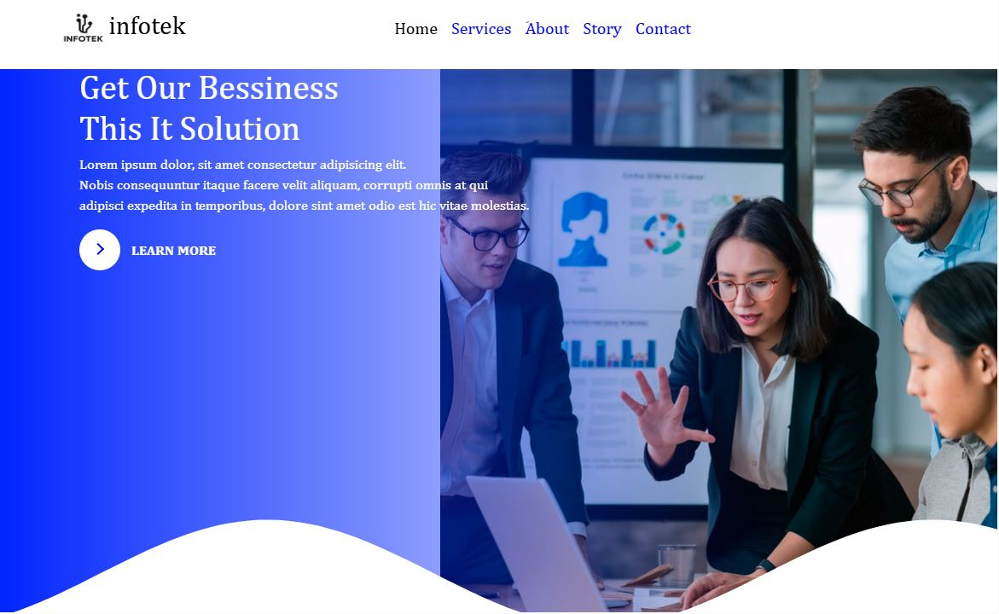

# Makeover Beauty Website

A simple and stylish website for showcasing aganecy services and tech. This website is built using **HTML, CSS, and Bootstrap** and is fully responsive.

## Features
- Attractive home page with service images
- About Us section
- Our Services section with informative cards
- Testimonial / Say people about us
- Contact form for sending messages
- Responsive design compatible with mobile and desktop
- Footer with contact info and quick links


## 🧪 project Structure

```
Agency/
├── index.html
├── css/
│   └── styles.css
├── images/
│   └── (all images used in the project)
└── README.md
```
## Requirements
- Modern web browser (Chrome, Firefox, Edge, Safari)
- Internet connection for loading Bootstrap and Font Awesome CDNs

## How to View the Website
1. Download or clone the `index.html` file from your repository.
2. Open the file with your preferred web browser.
3. All pages and sections are fully viewable locally.

## Screenshots


## ✍️ Author

**Somaya Ataie**  
[GitHub Profile](https://github.com/somayaataee)


##  Deployed (Render)

[🔗 [Open live demo — beauty-website-seven.vercel.app](https://beauty-website-seven.vercel.app/)]


